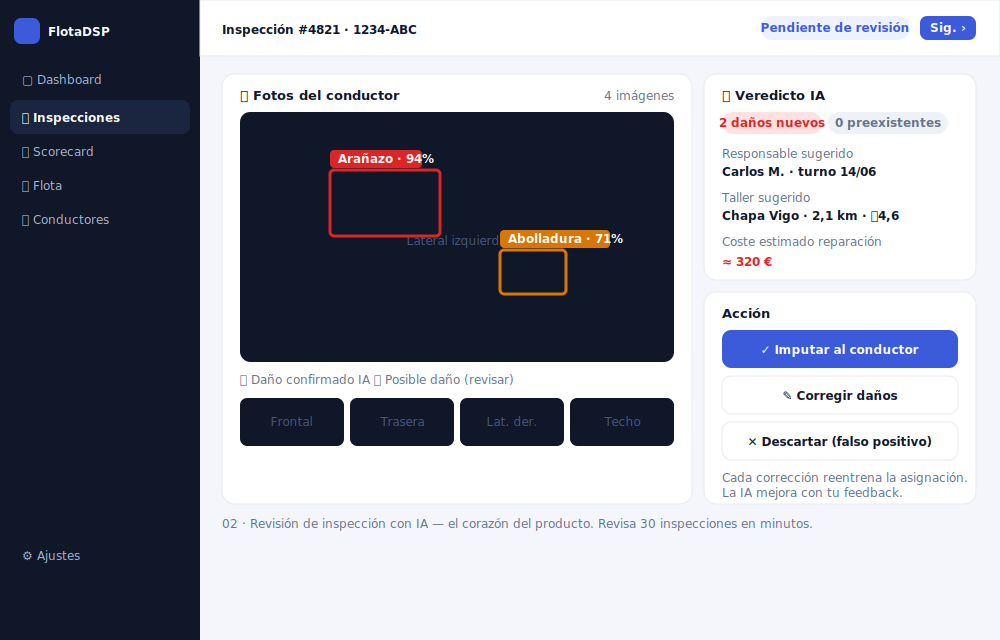
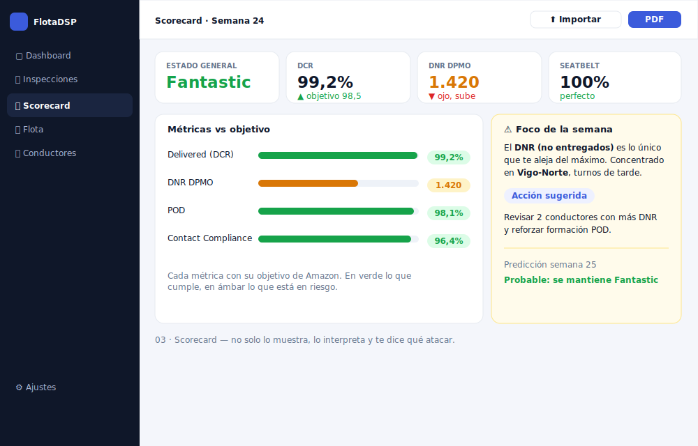
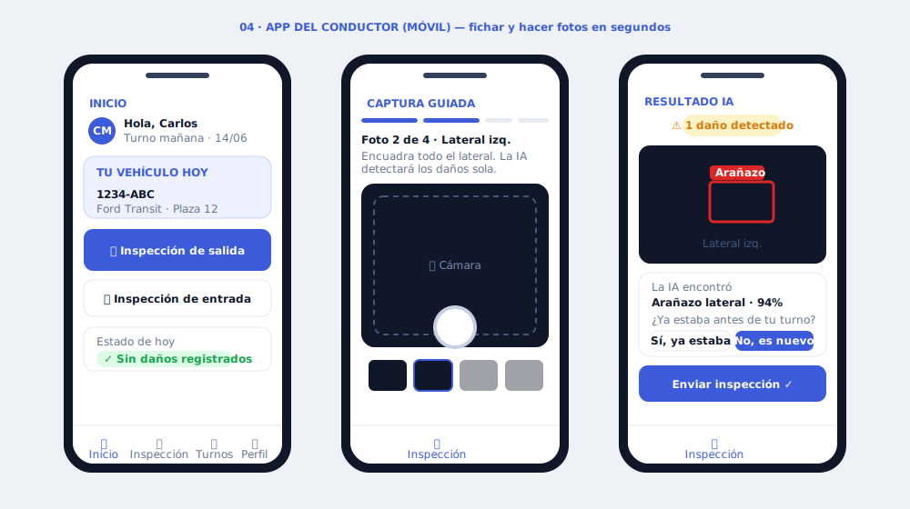
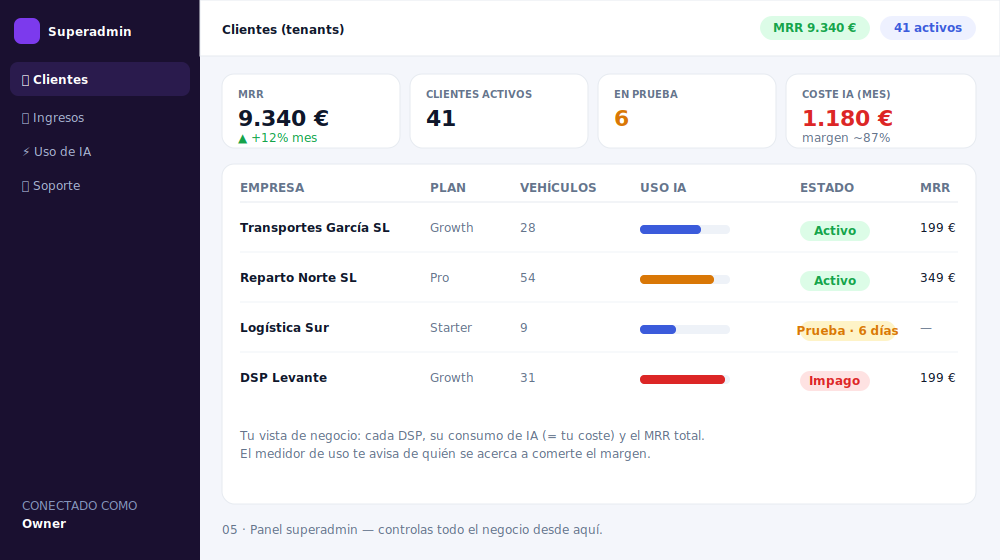

# FlotaDSP · Mockups de interfaz

Imágenes de cómo diseñaría la interfaz del SaaS sobre tu backend. Diseño orientado a eficiencia: lo crítico arriba, acciones de un clic, admin en escritorio y conductor en móvil.

> Estas imágenes son SVG y se ven renderizadas directamente aquí en GitHub (aunque el repo sea privado).

---

## 00 · Acceso y alta de empresa

## 01 · Dashboard del DSP

## 02 · Revisión de inspección con IA

## 03 · Scorecard de Amazon

## 04 · App del conductor (móvil)

## 05 · Panel superadmin (negocio)

---

*Mockups de diseño hechos en SVG para discusión. Datos de ejemplo, no es la app real.*
